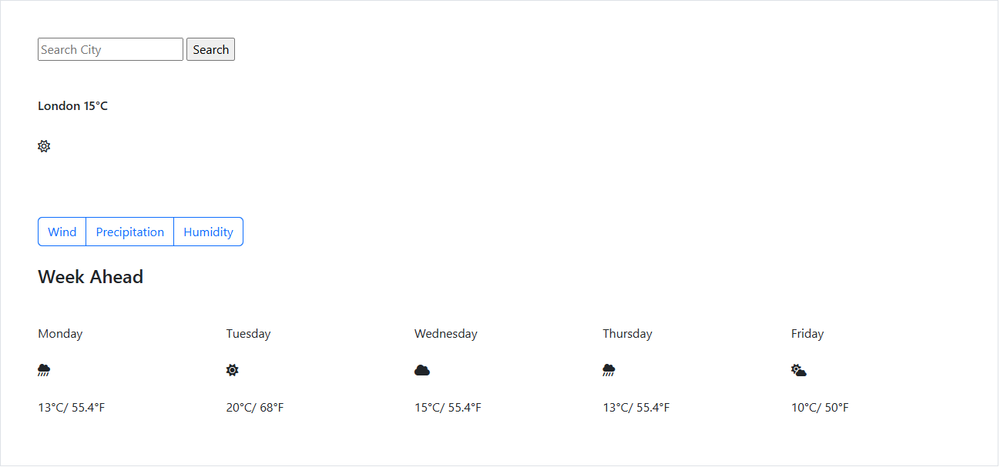

# Weather App (Basic Layout) - My First GitHub Project

## 🌦 About This Project

This project is my first experience using HTML and CSS to create a simple weather app layout. 
It is also my first time using GitHub to share and track my coding progress. 
The project does not include live weather data but focuses on basic concepts of structuring web pages, writing clean code and designing UI to make user friendly

## 🛠 Technologies Used

-- HTML for structuring the page

-- CSS for styling the elements

-- GitHub for version control and project sharing

## 📌 What I Learned

- ✅ How to structure a basic webpage using HTML
- ✅ How to style elements using CSS for a better user experience
- ✅ How to create a simple, clean layout for a weather app
- ✅ How to use GitHub to manage and share my code

## 📷 Preview
Here’s what my weather app looks like:  

## 🚀 How to Run the Project

Clone the repository:

git clone https://github.com/FedDawb/Weather-AppProject

Open the index.html file in a web browser

## 🔮 Future Improvements

-> Add JavaScript to fetch real-time weather data

-> Improve responsiveness for different screen sizes

-> Enhance the UI design with animations and interactive elements

This project is marks the beginning of my web development journey using HTML, CSS and using Github 
Click here to see how this project evolved to using Javascript and improved UI - https://github.com/FedDawb/VanillaWeatherProject

